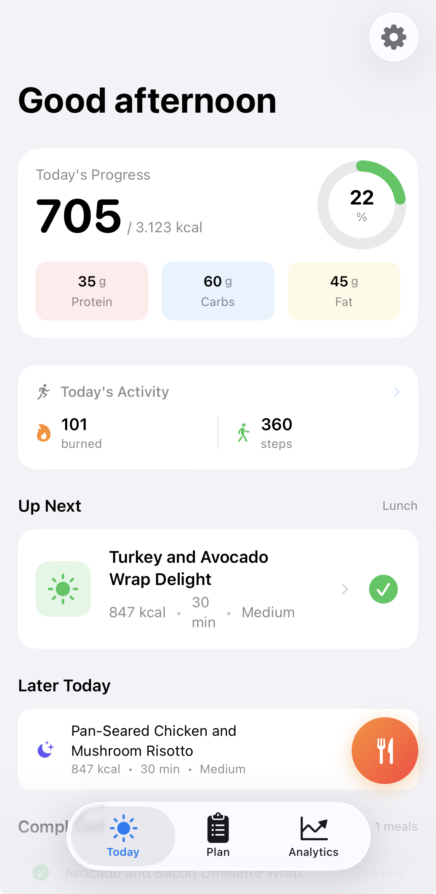
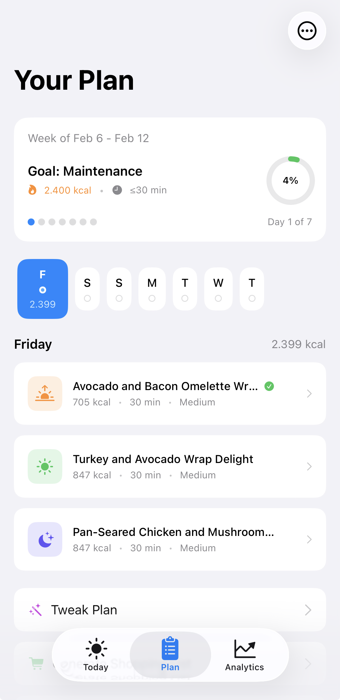

<p align="center">
  
</p>

<h1 align="center">DietAI</h1>

<p align="center">
  <strong>Your AI-Powered Personal Nutritionist</strong>
</p>

<p align="center">
  <em>Generate personalized meal plans, track nutrition, and reach your health goals — all powered by on-device AI that respects your privacy.</em>
</p>

<p align="center">
  
  
  
  
</p>

---

## ✨ Features

<table>
<tr>
<td width="50%">

### 🧠 On-Device AI
Generate complete weekly meal plans using state-of-the-art language models running entirely on your device. No data leaves your phone.

</td>
<td width="50%">

### 📸 Snap to Log
Take a photo of your meal and let AI estimate calories and macros instantly. Powered by Gemma3 vision model.

</td>
</tr>
<tr>
<td width="50%">

### 💪 HealthKit Integration
Automatically adjusts your nutrition targets based on workouts, steps, and activity level synced from Apple Health.

</td>
<td width="50%">

### ☁️ iCloud Sync
Your meal plans and logs sync seamlessly across all your devices via CloudKit.

</td>
</tr>
<tr>
<td width="50%">

### 🛒 Smart Shopping Lists
Automatically aggregates ingredients from your meal plan with intelligent grouping and quantity merging.

</td>
<td width="50%">

### 📊 Analytics Dashboard
Track your nutrition trends, workout patterns, and goal progress with beautiful Swift Charts visualizations.

</td>
</tr>
</table>

---

## 📱 Screenshots

<p align="center">
  
  
  
  
</p>

---

## 🏗️ Architecture

```
┌─────────────────────────────────────────────────────────────────┐
│                         DietAI App                              │
├─────────────────────────────────────────────────────────────────┤
│  Views          │  ViewModels      │  Services                  │
│  ─────────────  │  ──────────────  │  ────────────────────────  │
│  • TodayView    │  • Analytics     │  • AIModelService          │
│  • PlanView     │    ViewModels    │  • HealthKitService        │
│  • MealDetail   │                  │  • FoodVisionService       │
│  • Analytics    │                  │  • CloudSyncService        │
│  • FoodCamera   │                  │  • BarcodeScannerService   │
├─────────────────────────────────────────────────────────────────┤
│                     AI/ML Layer (MLX-Swift)                     │
│  ───────────────────────────────────────────────────────────    │
│  • ModelManager          │  Tiered model selection (4GB-8GB)    │
│  • VisionModelManager    │  Gemma3-4B / Qwen2.5-VL-3B          │
│  • ConstrainedGenerator  │  JSON grammar-guided generation      │
│  • SessionAwareGenerator │  KV cache optimization               │
├─────────────────────────────────────────────────────────────────┤
│                      Data Layer (SwiftData)                     │
│  ───────────────────────────────────────────────────────────    │
│  • DietPlan, Meal, MealLog  │  CloudKit sync enabled           │
│  • UserProfile              │  iCloud.com.garay.DietAI         │
└─────────────────────────────────────────────────────────────────┘
```

---

## 🤖 AI Models

DietAI uses a tiered model system that automatically selects the best model for your device:

| Tier | LLM Model | VLM Model | RAM Required |
|------|-----------|-----------|--------------|
| **Quality** | Llama 3.2 3B | Gemma3 4B | 8GB+ |
| **Standard** | Qwen 2.5 1.5B | Gemma3 4B | 6GB+ |
| **Fast** | Qwen 2.5 0.5B | Qwen2.5-VL 3B | 4GB+ |

All inference runs **100% on-device** using Apple's MLX framework — your data never leaves your phone.

---

## 🚀 Getting Started

### Requirements

- iOS 17.0+
- Xcode 15.0+
- Device with A14 chip or later (iPhone 12+)
- 4GB+ RAM recommended

### Installation

1. **Clone the repository**
   ```bash
   git clone https://github.com/yourusername/DietAI.git
   cd DietAI
   ```

2. **Open in Xcode**
   ```bash
   open DietAI.xcodeproj
   ```

3. **Configure signing**
   - Select your development team in Signing & Capabilities
   - Enable HealthKit and iCloud capabilities

4. **Build and run**
   - Select your target device
   - Press `Cmd + R` to build and run

### First Launch

1. Complete the onboarding to set your goals and preferences
2. Download the AI model (~2-4GB depending on device)
3. Connect HealthKit for activity-aware meal planning
4. Generate your first personalized meal plan!

---

## 🔑 Key Technologies

| Technology | Purpose |
|------------|---------|
| **SwiftUI** | Modern declarative UI |
| **SwiftData** | Persistence with CloudKit sync |
| **MLX-Swift** | On-device LLM/VLM inference |
| **HealthKit** | Activity and workout data |
| **AVFoundation** | Camera for food scanning |
| **Swift Charts** | Analytics visualizations |
| **CloudKit** | Cross-device sync |

---

## 📂 Project Structure

```
DietAI/
├── App/
│   └── DependencyContainer.swift    # Dependency injection
├── Models/
│   ├── DietModels.swift             # SwiftData models
│   ├── UserProfile.swift            # User preferences
│   ├── ActivityModels.swift         # Workout data
│   └── FoodEstimate.swift           # Vision analysis results
├── Services/
│   ├── AIModelService.swift         # High-level AI interface
│   ├── ModelManager.swift           # LLM loading & inference
│   ├── VisionModelManager.swift     # VLM loading & inference
│   ├── FoodVisionService.swift      # Food photo analysis
│   ├── HealthKitService.swift       # Apple Health integration
│   ├── CloudSyncService.swift       # iCloud sync
│   ├── ConstrainedDecoding/         # JSON grammar enforcement
│   └── Inference/                   # KV cache optimization
├── Views/
│   ├── Today/                       # Daily tracking
│   ├── Plan/                        # Meal plan display
│   ├── PlanBuilder/                 # Plan generation wizard
│   ├── Analytics/                   # Charts and insights
│   ├── FoodVision/                  # Camera & results
│   ├── BarcodeScanner/              # Product scanning
│   └── Components/                  # Reusable UI
└── ViewModels/
    └── AnalyticsViewModels.swift    # Analytics computation
```

---

## 🎯 Feature Highlights

### Intelligent Meal Planning

The AI generates meals that consider:
- Your calorie and macro targets
- Dietary restrictions and preferences
- Cuisine variety throughout the week
- Ingredient reuse for efficient shopping
- Post-workout protein optimization

### Snap to Log

1. 📷 Take a photo of your meal
2. 🤖 AI identifies foods and estimates portions
3. ✏️ Review and adjust if needed
4. ✅ Save to your daily log

Uses **Gemma3-4B** vision model for superior food recognition (especially proteins like salmon, chicken, etc.)

### Workout-Aware Nutrition

When you log a workout in Apple Health:
- **Strength training**: +70% calorie eat-back, protein boost recommended
- **Cardio**: +50% calorie eat-back
- **Recovery window**: Special recommendations 1-3 hours post-workout

---

## 🔒 Privacy

DietAI is designed with privacy as a core principle:

- **On-device AI**: All meal generation and food analysis runs locally
- **No tracking**: We don't collect analytics or usage data
- **Your data stays yours**: iCloud sync is end-to-end encrypted by Apple
- **HealthKit permissions**: Only reads the data you explicitly allow

---

## 🛠️ Development

### Building

```bash
xcodebuild -scheme DietAI \
  -destination 'platform=iOS Simulator,name=iPhone 16' \
  build
```

### Architecture Decisions

- **Constrained Decoding**: Uses JSON grammar to ensure valid output structure
- **KV Cache Optimization**: Reuses prompt context across meal generation for 20-40% speedup
- **Sequential Memory Strategy**: On devices <8GB, unloads LLM before loading VLM
- **CIImage Rendering**: Force-renders images before VLM inference (lazy evaluation fix)

---

## 📄 License

This project is licensed under the MIT License — see the [LICENSE](LICENSE) file for details.

---

## 🙏 Acknowledgments

- [MLX-Swift](https://github.com/ml-explore/mlx-swift) by Apple for on-device ML
- [Hugging Face](https://huggingface.co/mlx-community) MLX community for optimized models
- [Open Food Facts](https://world.openfoodfacts.org/) for barcode database

---

<p align="center">
  <strong>Built with ❤️ and SwiftUI</strong>
</p>

<p align="center">
  <sub>DietAI — Eat smarter, not harder.</sub>
</p>
